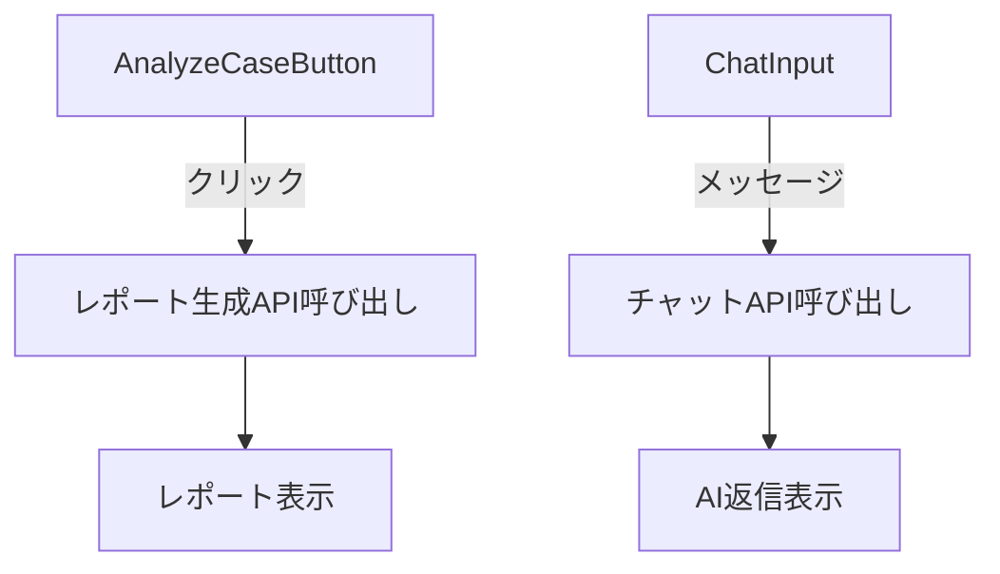

# レポート生成とチャット機能分離実装計画

## 目的
Analyze Caseボタンによるレポート生成と右側チャット機能を独立させ、シンプルな実装を実現する

## 実装ステップ

### 1. フロントエンド変更 (app/src/ui/)


### 2. バックエンド変更 (app/src/agent/)
- 既存のLangGraphワークフローを分割:
  - レポート生成フロー (`/api/generate-report`)
  - チャットフロー (`/api/chat`)

### 3. 状態管理
- レポート状態:
  ```typescript
  interface ReportState {
    currentReportId: string;
    reports: Map<string, Report>;
  }
  ```
- チャット状態:
  ```typescript
  interface ChatState {
    messages: ChatMessage[];
    currentReportContext?: string;
  }
  ```

### 4. APIエンドポイント
| エンドポイント | メソッド | 説明 |
|---------------|---------|------|
| `/api/generate-report` | POST | 新しいレポート生成 |
| `/api/chat` | POST | チャットメッセージ処理 |

### 5. データフロー
1. Analyze Caseボタンクリック
2. バックエンドでレポート生成
3. 生成完了後、フロントエンドにレポートIDと共に返却
4. ユーザーがチャットで質問
5. チャットAPIが最新レポートをコンテキストとして使用

## タイムライン

| タスク | 所要時間 | 優先度 |
|-------|---------|-------|
| フロントエンド分離 | 2日 | High |
| バックエンドAPI分割 | 1日 | High |
| 状態管理実装 | 1日 | Medium |
| テスト | 1日 | High |

## リスクと対応策

| リスク | 対応策 |
|-------|-------|
| レポート参照時のチャットコンテキスト喪失 | 最新レポートIDをセッションに保持 |
| 複数レポート生成時のメモリ問題 | 最新5件のみ保持 |

## 次に進むべきタスク

### 高優先度タスク
1. ReportGenerator.tsxのレポート有効期限管理機能実装
2. チャットセッション管理機能の実装
3. 負荷テスト用スクリプト作成

### 中優先度タスク
1. 複数レポート生成時の挙動確認テスト
2. パフォーマンステストの実施
   - レポート生成時間の計測
   - チャットレスポンス時間の計測
   - メモリ使用量の監視

### 低優先度タスク
1. 各コンポーネントの独立テストの追加
2. APIレスポンスの詳細な検証

## 詳細タスク分解

### フロントエンド作業
1. ResearchCanvas.tsxのリファクタリング
   *   [x] Analyze Caseボタンのクリックハンドラを分離
     - ReportStateContextを使用してレポート状態を管理
     - ADD_REPORTアクションでレポートを追加
   *   [x] レポート表示領域を独立コンポーネント化
     - ReportViewer.tsxを実装完了
     - レポート内容表示とコピーボタン機能を実装
   *   [x] チャット入力欄の状態管理を分離 (実装完了)

2. Main.tsxの修正
   *   [x] レポート状態用のContext作成
   *   [x] チャット状態用のContext作成
     - ChatStateContext.tsxを実装完了
     - メッセージ履歴と現在のレポートコンテキストを管理
   *   [x] API呼び出しロジックの分割

3. 新規コンポーネント作成
   *   [x] ReportViewer.tsx: レポート表示専用 (実装完了、Map.get()を使用するよう修正)
   *   [x] ReportGenerator.tsx: レポート生成処理 (基本実装完了)
   *   [x] ReportGenerator.tsx: レポート有効期限管理機能 (実装完了)
   *   [x] ChatInterface.tsx: チャット機能専用 (実装完了)
     - 空メッセージチェック機能を追加
     - ローディング状態とエラーメッセージ表示を実装
     - テストケース「does not send empty message」をパス
     - テストケース「shows loading state」を追加
     - テストケース「displays error messages」を追加

### バックエンド作業
1. server.pyの修正
   *   [x] `/api/generate-report`エンドポイント作成 (実装完了)
   *   [x] `/api/chat`エンドポイント作成 (実装完了)
   *   [x] 既存の統合エンドポイントを非推奨化 (410ステータスで実装)

2. agent.pyの修正
   *   [x] レポート生成ワークフローの分離 (analyze_case_nodeで実装)
   *   [x] チャットワークフローの最適化 (chat_nodeで実装)
   *   [x] コンテキスト管理の改善 (report_idをキーに管理)

3. テスト作成
   *   [x] `/api/generate-report` 単体テスト (基本ケース完了)
   *   [x] `/api/chat` 単体テスト (基本ケース完了)
   *   [x] エッジケーステスト (基本ケース完了)
   *   [x] 統合テストシナリオ作成 (基本フロー設計完了)
   *   [x] 統合テスト実装 (基本フロー完了)
   *   [x] 負荷テスト用スクリプト作成 (app/src/agent/load_test.pyに実装完了)

### 状態管理作業
1. レポート状態実装
   *   [x] 最新レポートID追跡
     - ReportStateContextでcurrentReportIdを管理
   *   [x] レポートキャッシュ管理
     - Mapオブジェクトでレポートを保持
   *   [x] レポート有効期限設定 (実装完了)
     - レポート生成時に24時間の有効期限を設定
     - 期限切れレポートの自動削除機能を実装
     - テストケース追加完了 (単体テストと統合テスト)

2. チャット状態実装
   *   [x] メッセージ履歴管理 (基本実装完了)
   *   [x] アクティブレポートコンテキスト保持 (基本実装完了)
   *   [x] チャットセッション管理 (実装完了)
     - [x] セッションタイムアウト処理の実装 (30分間の非アクティブでタイムアウト)
     - [x] タイムアウト通知UIの追加 (メッセージに注記を追加)
     - [x] タイムアウト時の自動クリーンアップ (ChatStateContext.tsxに実装)

### テスト計画
1. 単体テスト
   *   [ ] 各コンポーネントの独立テスト
   *   [x] 状態管理のテスト
     - ReportStateContextの基本動作を確認
     - レポート追加/更新/削除のテストケースを追加
   *   [ ] APIレスポンスの検証

2. 統合テスト
   *   [x] レポート生成→チャットの連携テスト (基本フローテスト完了)
   *   [ ] 複数レポート生成時の挙動確認 (進行中)
   *   [x] エラーケースのテスト (基本エラーハンドリングテスト完了)

3. パフォーマンステスト
   *   [x] レポート生成時間の計測 (load_test.pyに実装)
   *   [x] チャットレスポンス時間の計測 (load_test.pyに実装)
   *   [x] メモリ使用量の監視 (load_test.pyに実装)

## 拡張ポイント
1. 将来的なPostgreSQL連携
2. ベクターDBによるレポート検索機能
3. レポート比較機能
